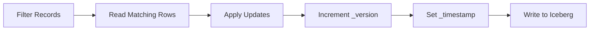

# Bulk Operations

Ibex DB supports powerful bulk operations that allow you to update or delete thousands of records matching a filter criteria with a single API request.

## Bulk Updates

Update all records matching a filter:

```json
{
  "operation": "UPDATE",
  "tenant_id": "my-tenant",
  "table": "products",
  "filter": {
    "category": {"eq": "electronics"}
  },
  "updates": {
    "discount": 10,
    "on_sale": true
  }
}
```

**What happens:**
1. Query finds all matching records
2. Each record is updated with new values
3. `_version` is incremented
4. `_timestamp` is updated
5. All changes are written atomically

<Tip>
Bulk updates preserve version history - you can query previous versions of all updated records!
</Tip>

---

## How Bulk Updates Work

### Internal Process



1. **Query Phase**: DuckDB finds all records matching the filter
2. **Update Phase**: Each record is modified in memory
3. **Write Phase**: PyIceberg writes all updated records to S3
4. **Commit Phase**: Iceberg commits the transaction atomically

### Performance

- **Small updates** (<100 records): 1200-1500ms
- **Medium updates** (100-1000 records): 1500-2000ms
- **Large updates** (1000+ records): 2000-3000ms

<Note>
Bulk updates are optimized for throughput - updating 1000 records takes about the same time as updating 100!
</Note>

---

## Common Use Cases

### Price Updates

Update all products in a category:

```json
{
  "operation": "UPDATE",
  "tenant_id": "ecommerce",
  "table": "products",
  "filter": {
    "category": {"eq": "electronics"},
    "price": {"gte": 100}
  },
  "updates": {
    "price": {"multiply": 0.9},  // 10% discount
    "on_sale": true,
    "sale_start": "2025-11-15T00:00:00Z"
  }
}
```

### Status Changes

Mark all inactive users:

```json
{
  "operation": "UPDATE",
  "tenant_id": "my-tenant",
  "table": "users",
  "filter": {
    "_timestamp": {
      "lt": "2024-11-14T00:00:00Z"  // Not updated in over a year
    }
  },
  "updates": {
    "status": "inactive",
    "last_activity_check": "2025-11-14T00:00:00Z"
  }
}
```

### Batch Corrections

Fix data errors in bulk:

```json
{
  "operation": "UPDATE",
  "tenant_id": "my-tenant",
  "table": "orders",
  "filter": {
    "shipping_country": {"eq": "USA"}
  },
  "updates": {
    "shipping_country": "US",  // Standardize country codes
    "corrected_at": "2025-11-14T00:00:00Z"
  }
}
```

---

## Bulk Deletes

Soft delete all records matching a filter:

```json
{
  "operation": "DELETE",
  "tenant_id": "my-tenant",
  "table": "users",
  "filter": {
    "status": {"eq": "inactive"},
    "_timestamp": {
      "lt": "2024-01-01T00:00:00Z"
    }
  }
}
```

**What happens:**
- All matching records have `_deleted` set to `true`
- `_deleted_at` is set to current timestamp
- `_version` is incremented
- Records remain in database for audit purposes

### Hard Delete (Permanent)

<Warning>
**Permanent deletion** - cannot be recovered!
</Warning>

```json
{
  "operation": "HARD_DELETE",
  "tenant_id": "my-tenant",
  "table": "logs",
  "filter": {
    "_timestamp": {
      "lt": "2024-11-14T00:00:00Z"
    }
  }
}
```

**Use cases:**
- GDPR right to be forgotten
- Removing old logs/temp data
- Storage cost optimization

---

## Complex Filters

Combine multiple conditions for precise targeting:

### Multiple AND Conditions

```json
{
  "operation": "UPDATE",
  "tenant_id": "my-tenant",
  "table": "products",
  "filter": {
    "category": {"eq": "electronics"},
    "stock": {"lt": 10},
    "price": {"gte": 100, "lte": 500}
  },
  "updates": {
    "low_stock_alert": true
  }
}
```

### Using IN Operator

```json
{
  "operation": "UPDATE",
  "tenant_id": "my-tenant",
  "table": "users",
  "filter": {
    "region": {"in": ["US-WEST", "US-EAST", "US-CENTRAL"]},
    "subscription": {"eq": "premium"}
  },
  "updates": {
    "feature_flag_enabled": true
  }
}
```

### Pattern Matching

```json
{
  "operation": "DELETE",
  "tenant_id": "my-tenant",
  "table": "logs",
  "filter": {
    "message": {"like": "%deprecated%"},
    "_timestamp": {
      "lt": "2025-01-01T00:00:00Z"
    }
  }
}
```

---

## Response Format

Bulk operations return summary information:

```json
{
  "success": true,
  "records_updated": 1523,
  "metadata": null,
  "request_id": "abc-123",
  "execution_time_ms": 1847.32
}
```

<Note>
**Why no detailed metadata?**

Bulk operations focus on throughput. Detailed per-record metadata would slow down the operation significantly.
</Note>

---

## Best Practices

<AccordionGroup>
  <Accordion title="Test Filters First">
    Always test your filter with a QUERY before running bulk UPDATE/DELETE:
    
    ```json
    // 1. Test filter
    {
      "operation": "QUERY",
      "tenant_id": "my-tenant",
      "table": "products",
      "filter": {
        "category": {"eq": "electronics"}
      },
      "projection": ["id", "name"],
      "limit": 10
    }
    
    // 2. If results look good, run bulk update
    {
      "operation": "UPDATE",
      "tenant_id": "my-tenant",
      "table": "products",
      "filter": {
        "category": {"eq": "electronics"}
      },
      "updates": {
        "discount": 10
      }
    }
    ```
  </Accordion>

  <Accordion title="Use Specific Filters">
    ✅ **Good** - Specific filter:
    ```json
    {
      "filter": {
        "_tenant_id": {"eq": "my-tenant"},
        "status": {"eq": "inactive"},
        "_timestamp": {"lt": "2024-01-01T00:00:00Z"}
      }
    }
    ```
    
    ❌ **Bad** - Too broad:
    ```json
    {
      "filter": {
        "status": {"eq": "inactive"}
      }
    }
    ```
    
    **Why?** Specific filters reduce the risk of accidentally updating wrong records.
  </Accordion>

  <Accordion title="Monitor Performance">
    Track bulk operation performance:
    
    - **<1000 records**: Should complete in <2s
    - **1000-5000 records**: Should complete in <5s
    - **>5000 records**: Consider breaking into batches
    
    If operations are slow:
    - Check filter selectivity
    - Verify tenant_id is included
    - Consider running during off-peak hours
  </Accordion>

  <Accordion title="Batch Large Operations">
    For very large updates (>10,000 records), batch them:
    
    ```python
    # Instead of updating all at once
    def bulk_update_in_batches(table, filter, updates, batch_size=5000):
        offset = 0
        while True:
            # Query batch
            batch = query(
                table=table,
                filter=filter,
                limit=batch_size,
                offset=offset
            )
            
            if not batch["data"]:
                break
            
            # Update batch
            update(
                table=table,
                filter={
                    "_record_id": {
                        "in": [r["_record_id"] for r in batch["data"]]
                    }
                },
                updates=updates
            )
            
            offset += batch_size
    ```
  </Accordion>
</AccordionGroup>

---

## Safety Features

### Audit Trail Preservation

All bulk operations preserve complete audit history:

```json
// Before bulk update
{
  "_record_id": "abc123",
  "_version": 1,
  "_timestamp": "2025-11-14T10:00:00Z",
  "price": 100
}

// After bulk update
{
  "_record_id": "abc123",
  "_version": 2,
  "_timestamp": "2025-11-14T15:00:00Z",
  "price": 90
}

// Old version still queryable via time travel
{
  "operation": "QUERY",
  "table": "products",
  "as_of": "2025-11-14T12:00:00Z"  // Before the update
}
```

### Rollback Support

Roll back bulk updates using time travel:

```python
# 1. Record timestamp before update
before_update = "2025-11-14T15:00:00Z"

# 2. Run bulk update
update(...)

# 3. If something went wrong, query old values
old_data = query(
    table="products",
    as_of=before_update,
    filter={"category": {"eq": "electronics"}}
)

# 4. Restore old values
for record in old_data["data"]:
    update(
        table="products",
        filter={"_record_id": {"eq": record["_record_id"]}},
        updates={k: v for k, v in record.items() if not k.startswith("_")}
    )
```

---

## Performance Optimization

### Include Tenant ID

Always include `_tenant_id` in filters for best performance:

✅ **Fast**:
```json
{
  "filter": {
    "_tenant_id": {"eq": "my-tenant"},
    "status": {"eq": "inactive"}
  }
}
```

❌ **Slow**:
```json
{
  "filter": {
    "status": {"eq": "inactive"}
  }
}
```

### Use Indexed Fields

Prefer filtering on indexed fields:

**Fast (indexed)**:
- `_tenant_id`
- `_record_id`
- Any field in your partition spec

**Slower (full scan)**:
- `_version`
- `_deleted`
- Non-indexed user fields

### Projection After Update

To see updated records, query immediately after:

```bash
# 1. Bulk update
curl -X POST "https://your-domain.com/path" \
  -H "x-api-key: YOUR_API_KEY" \
  -d '{
    "operation": "UPDATE",
    "tenant_id": "my-tenant",
    "table": "products",
    "filter": {"category": {"eq": "electronics"}},
    "updates": {"discount": 10}
  }'

# 2. Query updated records
curl -X POST "https://your-domain.com/path" \
  -H "x-api-key: YOUR_API_KEY" \
  -d '{
    "operation": "QUERY",
    "tenant_id": "my-tenant",
    "table": "products",
    "filter": {
      "category": {"eq": "electronics"},
      "_version": {"eq": 2}  // New version
    },
    "limit": 10
  }'
```

---

## Error Handling

### Filter Matches No Records

```json
{
  "success": true,
  "records_updated": 0,
  "execution_time_ms": 245.12
}
```

**Not an error** - the operation completed successfully but found no matching records.

### Invalid Filter

```json
{
  "success": false,
  "error": "Invalid filter: field 'invalid_field' does not exist",
  "request_id": "abc-123"
}
```

**Fix**: Verify field names match your table schema.

### Update Conflicts

Bulk updates are atomic - either all records are updated or none:

```json
{
  "success": false,
  "error": "Update conflict: concurrent modification detected",
  "request_id": "abc-123"
}
```

**Fix**: Retry the operation. Iceberg's optimistic concurrency control will resolve conflicts.

---

## Examples

### Seasonal Price Adjustments

```json
{
  "operation": "UPDATE",
  "tenant_id": "retail",
  "table": "products",
  "filter": {
    "season": {"eq": "summer"},
    "_timestamp": {"lt": "2025-09-01T00:00:00Z"}
  },
  "updates": {
    "price": {"multiply": 0.7},  // 30% off
    "clearance": true
  }
}
```

### User Cleanup

```json
{
  "operation": "DELETE",
  "tenant_id": "saas-app",
  "table": "users",
  "filter": {
    "email_verified": {"eq": false},
    "_timestamp": {"lt": "2025-10-14T00:00:00Z"}  // Created >30 days ago
  }
}
```

### Data Migration

```json
{
  "operation": "UPDATE",
  "tenant_id": "my-tenant",
  "table": "legacy_data",
  "filter": {
    "migrated": {"eq": false}
  },
  "updates": {
    "new_format": true,
    "migrated": true,
    "migration_date": "2025-11-14T00:00:00Z"
  }
}
```

---

## Quick Reference

### Supported Operations

| Operation | Description | Soft Delete | Version History |
|-----------|-------------|-------------|-----------------|
| `UPDATE` | Bulk update matching records | No | Yes |
| `DELETE` | Soft delete matching records | Yes | Yes |
| `HARD_DELETE` | Permanently delete records | N/A | No (deleted) |

### Filter Operators

| Operator | Example | Description |
|----------|---------|-------------|
| `eq` | `{"status": {"eq": "active"}}` | Equal |
| `ne` | `{"status": {"ne": "deleted"}}` | Not equal |
| `gt` | `{"age": {"gt": 18}}` | Greater than |
| `gte` | `{"price": {"gte": 100}}` | Greater than or equal |
| `lt` | `{"stock": {"lt": 10}}` | Less than |
| `lte` | `{"discount": {"lte": 50}}` | Less than or equal |
| `in` | `{"region": {"in": ["US", "EU"]}}` | In list |
| `like` | `{"name": {"like": "%test%"}}` | Pattern match |

### Performance Tips

- ✅ Always include `_tenant_id` in filters
- ✅ Test filters with QUERY before bulk operations
- ✅ Use specific filters to limit scope
- ✅ Batch very large operations (>10k records)
- ✅ Run during off-peak hours for large updates
- ⚠️ Monitor execution times
- ⚠️ Consider impact on concurrent users

