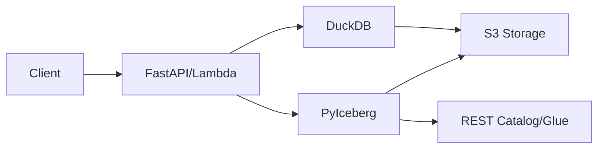

# Welcome to Ibex DB

A **serverless, production-ready ACID database** that combines the power of Apache Iceberg, DuckDB, and AWS S3 to deliver enterprise-grade data management with zero infrastructure overhead.

## What is Ibex DB?

Ibex DB provides full ACID transactions on top of S3 object storage, making it perfect for:

- **Analytics workloads** with complex aggregations and sub-100ms query times
- **Audit trails** with complete version history and time travel queries
- **Multi-tenant SaaS** applications with built-in tenant isolation
- **Serverless architectures** with automatic scaling and zero ops

## Key Features

<CardGroup cols={2}>
  <Card title="ACID Transactions" icon="shield-check">
    Full ACID guarantees via Apache Iceberg with PyIceberg for writes
  </Card>
  <Card title="Lightning Fast" icon="bolt">
    DuckDB queries in ~100ms with intelligent caching
  </Card>
  <Card title="Time Travel" icon="clock-rotate-left">
    Query data as it existed at any point in time
  </Card>
  <Card title="Multi-Tenant" icon="users">
    Built-in tenant isolation for SaaS applications
  </Card>
  <Card title="Complete Audit Trail" icon="list-check">
    Track every change with automatic versioning and audit fields
  </Card>
  <Card title="API Key Auth" icon="key">
    Secure API access with built-in authentication
  </Card>
  <Card title="Bulk Operations" icon="layer-group">
    Update thousands of records with a single filtered operation
  </Card>
  <Card title="Auto-Optimization" icon="wand-magic-sparkles">
    Automatic table compaction and snapshot expiration
  </Card>
</CardGroup>

## Architecture



**Write Path:**
- Client → Lambda/FastAPI → PyIceberg → Catalog (REST/Glue) → S3 (Parquet + Metadata)

**Read Path:**
- Client → Lambda/FastAPI → DuckDB iceberg_scan → S3 (Parquet files)

## Why Ibex DB?

<AccordionGroup>
  <Accordion title="Zero Infrastructure">
    No databases to manage, no clusters to maintain. Just S3, Lambda, and API Gateway.
  </Accordion>
  <Accordion title="Cost-Effective">
    Pay only for storage and compute you use. No idle costs. ~$0.01 per 1000 requests.
  </Accordion>
  <Accordion title="Production-Ready">
    ACID transactions, audit trails, version history, and API authentication built-in.
  </Accordion>
  <Accordion title="Enterprise Performance">
    ~100ms query times with 5-minute metadata caching and DuckDB optimization.
  </Accordion>
</AccordionGroup>

## Performance Metrics

<Note>
**Production Performance (4GB Lambda, 16 threads)**
- Simple queries: 80-120ms
- Filtered queries: 90-150ms
- Aggregations: 100-200ms
- Writes: 1200-2000ms
- Cold start: ~4000ms
</Note>

## Quick Example

```json
{
  "operation": "QUERY",
  "tenant_id": "acme-corp",
  "table": "sales",
  "filter": {
    "region": {"in": ["US", "EU"]},
    "revenue": {"gte": 1000}
  },
  "aggregations": [
    {"field": "revenue", "function": "sum", "alias": "total_revenue"},
    {"field": "*", "function": "count", "alias": "order_count"}
  ],
  "group_by": ["region"],
  "sort": [{"field": "total_revenue", "order": "DESC"}]
}
```

**Response includes detailed metadata:**
```json
{
  "success": true,
  "data": [...],
  "metadata": {
    "row_count": 100,
    "execution_time_ms": 104.26,
    "scanned_bytes": 9747,
    "scanned_rows": 100,
    "cache_hit": true,
    "query_id": "uuid"
  }
}
```

## Next Steps

<CardGroup cols={2}>
  <Card title="Quickstart" icon="rocket" href="/quickstart">
    Get started in 5 minutes
  </Card>
  <Card title="API Reference" icon="book" href="/api/overview">
    Explore the API
  </Card>
  <Card title="Examples" icon="code" href="/examples/basic-crud">
    See code examples
  </Card>
  <Card title="GitHub" icon="github" href="https://github.com/yourusername/s3-acid-database">
    View source code
  </Card>
</CardGroup>
