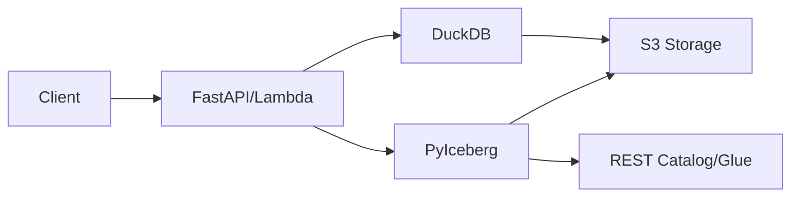

# Welcome to S3 ACID Database

A **serverless, production-ready ACID database** that combines the power of Apache Iceberg, DuckDB, and S3 to deliver enterprise-grade data management with zero infrastructure overhead.

## What is S3 ACID Database?

S3 ACID Database provides full ACID transactions on top of S3 object storage, making it perfect for:

- **Analytics workloads** with complex aggregations
- **Audit trails** with complete version history
- **Multi-tenant applications** with built-in isolation
- **Serverless architectures** requiring zero ops

## Key Features

<CardGroup cols={2}>
  <Card title="ACID Transactions" icon="shield-check">
    Full ACID guarantees via Apache Iceberg with PyIceberg for writes
  </Card>
  <Card title="Fast Queries" icon="bolt">
    DuckDB with native Iceberg support for lightning-fast analytics
  </Card>
  <Card title="Type-Safe API" icon="code">
    Complete Pydantic validation ensures data integrity
  </Card>
  <Card title="Multi-Tenant" icon="users">
    Built-in tenant isolation for SaaS applications
  </Card>
  <Card title="Version History" icon="clock-rotate-left">
    Track every change with automatic versioning
  </Card>
  <Card title="Serverless" icon="cloud">
    Deploy on AWS Lambda or run locally with Docker
  </Card>
</CardGroup>

## Architecture



**Write Path:**
- Client → Lambda/FastAPI → PyIceberg → Catalog (REST/Glue) → S3 (Parquet + Metadata)

**Read Path:**
- Client → Lambda/FastAPI → DuckDB iceberg_scan → S3 (Parquet files)

## Why S3 ACID Database?

<AccordionGroup>
  <Accordion title="Zero Infrastructure">
    No databases to manage, no clusters to maintain. Just S3 and Lambda.
  </Accordion>
  <Accordion title="Cost-Effective">
    Pay only for storage and compute you use. No idle costs.
  </Accordion>
  <Accordion title="Enterprise-Grade">
    ACID transactions, audit trails, and version history built-in.
  </Accordion>
  <Accordion title="Scale to Zero">
    Perfect for serverless architectures with automatic scaling.
  </Accordion>
</AccordionGroup>

## Quick Example

```json
{
  "operation": "QUERY",
  "tenant_id": "acme-corp",
  "table": "sales",
  "projection": ["region", "product"],
  "aggregations": [
    {"op": "sum", "field": "revenue", "alias": "total_revenue"},
    {"op": "count", "field": null, "alias": "order_count"}
  ],
  "group_by": ["region", "product"],
  "having": {"total_revenue": {"gt": 10000}}
}
```

## Next Steps

<CardGroup cols={2}>
  <Card title="Quickstart" icon="rocket" href="/quickstart">
    Get started in 5 minutes
  </Card>
  <Card title="API Reference" icon="book" href="/api/overview">
    Explore the API
  </Card>
  <Card title="Examples" icon="code" href="/examples/basic-crud">
    See code examples
  </Card>
  <Card title="GitHub" icon="github" href="https://github.com/yourusername/s3-acid-database">
    View source code
  </Card>
</CardGroup>
